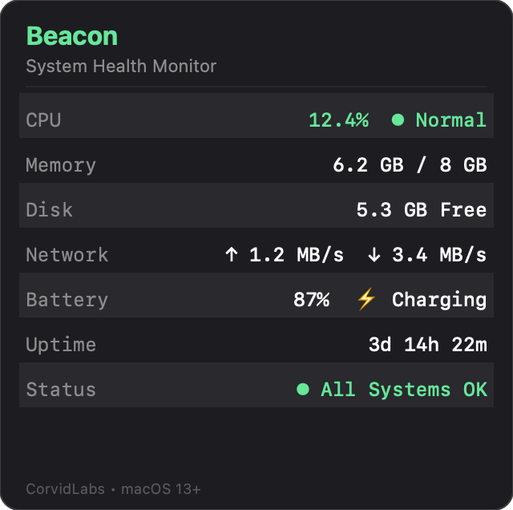

# Beacon

System health beacon for macOS menu bar. Shows a colored status indicator based on system health with a dropdown displaying CPU, memory, disk, network, battery, and uptime metrics.



## Status Levels

- **Green** — All systems normal
- **Yellow** — One metric elevated (CPU >70%, Memory >80%, Disk >90%)
- **Red** — Critical (CPU >90%, Memory >95%, or network down)

## Build

```
swift build
```

## Run

```
swift run Beacon
```

## Metrics

| Metric  | Source                     |
|---------|----------------------------|
| CPU     | Mach `host_processor_info` |
| Memory  | Mach `host_statistics64`   |
| Disk    | `FileManager` attributes   |
| Network | ping 8.8.8.8               |
| Battery | `pmset -g batt`            |
| Uptime  | `ProcessInfo.systemUptime` |

Polls every 3 seconds.
